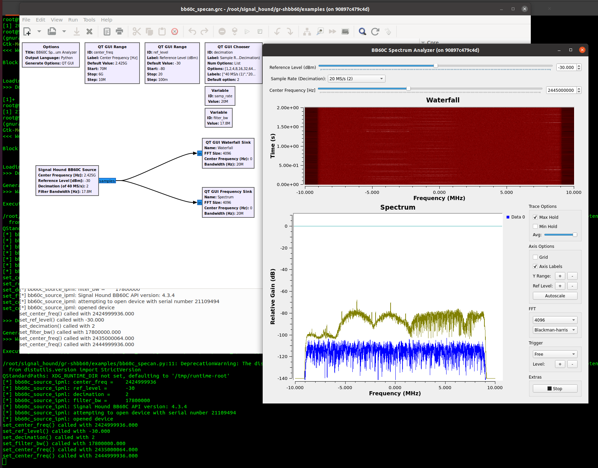

# gr-shbb60

A GNURadio 3.9 OOT (out-of-tree) module for the Signal Hound BB60C USB spectrum analyzer.

## Building

First, install [GNURadio 3.9](https://github.com/gnuradio/gnuradio) and the [Signal Hound SDK](https://signalhound.com/software/signal-hound-software-development-kit-sdk/). Then build the GNURadio OOT module.

```
$ mkdir build
$ cd build
build/$ cmake ..
build/$ make
build/$ sudo make install
build/$ sudo ldconfig
```

An example spectrum analyzer flowgraph can be found at `examples/bb60c_specan.grc`.

